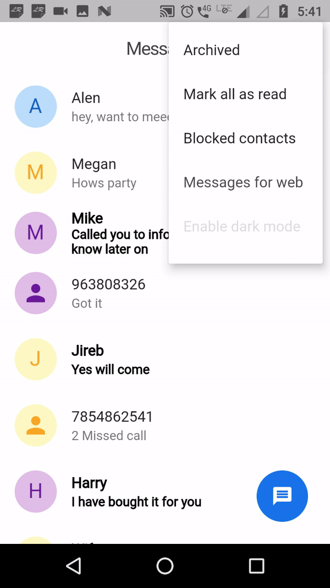

# FlutterMessagesClone  
The Android Messages App Clone in Flutter.

# Show me

# Catch me here

## Getting Started with Flutter

For help getting started with Flutter, view online
[documentation](https://flutter.io/)

## License
Copyright 2019 Pinkesh Darji

Licensed under the Apache License, Version 2.0 (the "License"); you may not use this file except in compliance with the License. You may obtain a copy of the License at

http://www.apache.org/licenses/LICENSE-2.0

Unless required by applicable law or agreed to in writing, software distributed under the License is distributed on an "AS IS" BASIS, WITHOUT WARRANTIES OR CONDITIONS OF ANY KIND, either express or implied. See the License for the specific language governing permissions and limitations under the License.

